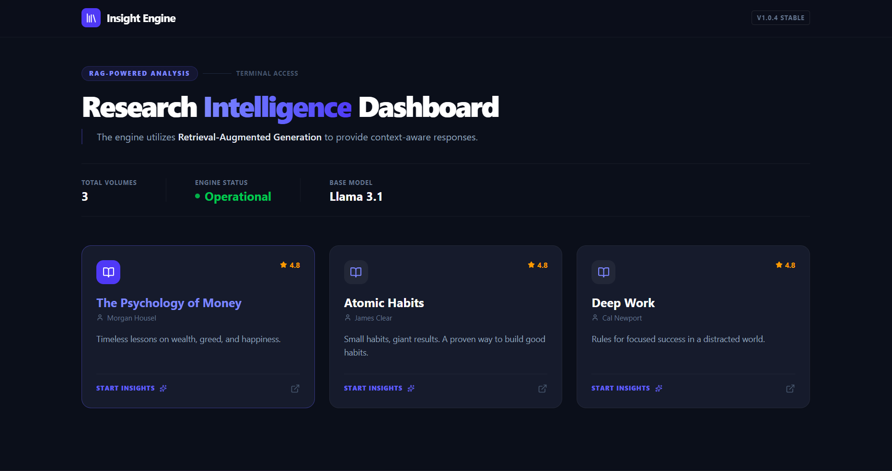
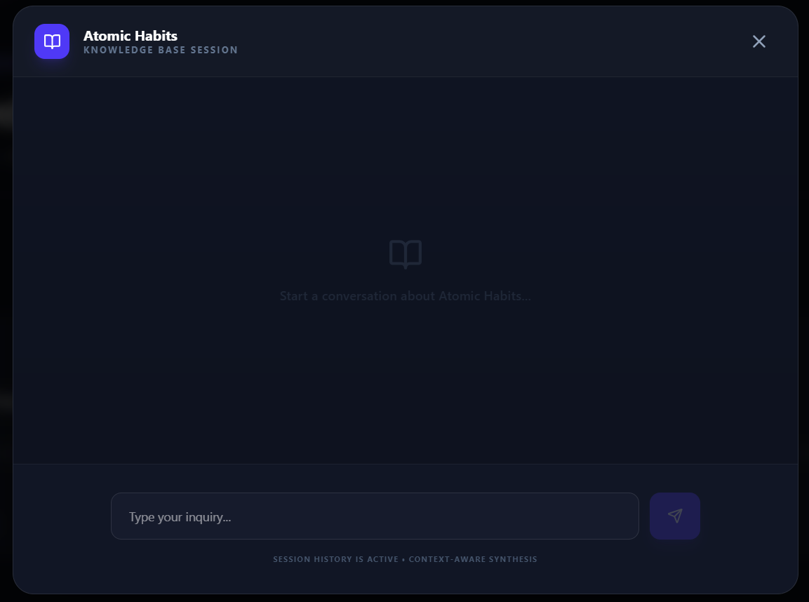
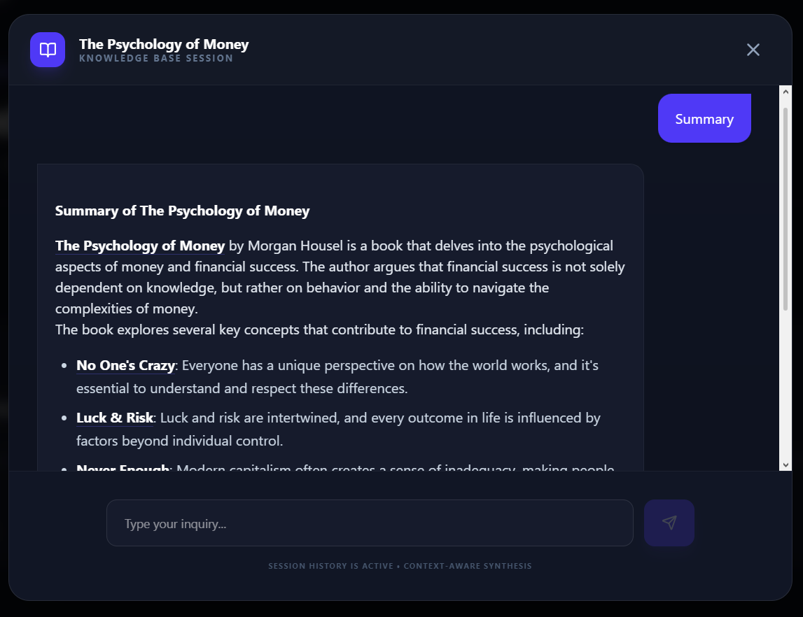

# AI-Powered Book Insight Platform

An advanced RAG (Retrieval-Augmented Generation) application built with **Django, React, and Llama 3.1.

## Screenshots
*(Screenshots yahan upload karke unke link daal dena)*
- **Dashboard:** 
- **Chat Interface:** 
- **AI Response:** 

##  Setup Instructions

### 1. Clone the Repository
git clone [https://github.com/sudhanshujunejalinkedin/ai-book-insight-platform.git](https://github.com/sudhanshujunejalinkedin/ai-book-insight-platform.git)
cd ai-book-insight-platform

2. **Backend Setup:**
   - `cd backend`
   - `pip install -r requirements.txt`
   - Create `.env` file and add `GROQ_API_KEY=your_key_here`
   - `python manage.py migrate`
   - `python seed_data.py` (To load books)
   - `python manage.py runserver`
3. **Frontend Setup:**
   - `cd frontend`
   - `npm install`
   - `npm run dev`

## API Documentation
- `GET /api/books/` - List all books.
- `POST /api/ask/` - Submit a question (requires `book_id` and `query`).

## Sample Q&A
- **Q:** What are the key laws in 'Atomic Habits'?
- **A:** Key Laws in 'Atomic Habits'
The 4 Laws of Behavior Change in 'Atomic Habits' by James Clear are:

1. Make it Obvious (Cue): This law emphasizes the importance of creating an obvious cue or trigger for a new habit.
2. Make it Attractive (Craving): This law focuses on making the new habit appealing and desirable.
3. Make it Easy (Response): This law makes the new habit easy to perform by reducing the number of decisions needed to take action.
4. Make it Satisfying (Reward): This law emphasizes the importance of providing a satisfying reward after completing a new habit.
These laws provide a comprehensive framework for understanding and changing behavior, and are a key part of the book's approach to building good habits and breaking bad ones.

## Author

Developed with ❤️ by **Sudhanshu Juneja** *Connect with me on [LinkedIn](www.linkedin.com/in/sudhanshu-juneja)

##  Disclaimer
This project was developed as part of an **AI Internship Challenge**. All book contents are used for educational and demonstration purposes only.
